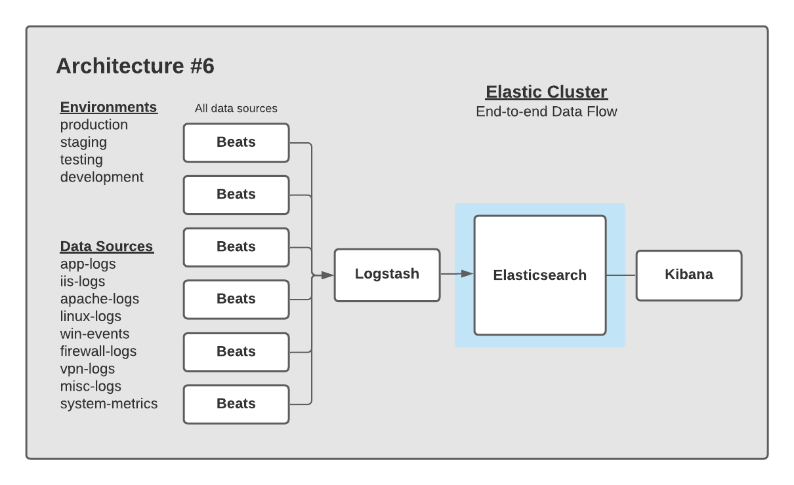
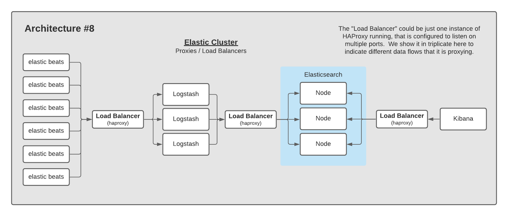

# Elastic Architectures

This directory provides a series of layouts for Elasticsearch clusters.  The goal is to share architectures of various data flows for environments using the Elastic Stack.

Architectures are *not* ranked by popularity, simply by a number so they can easily be referenced.  Some architectures are not particularly great, but represented for thoroughness.

## Architecture #1

A relatively standard pattern of having one Elastic cluster per environment, with each environment having its own Kibana instance.  Each cluster is ingesting data from data sources only from its environment.

## Architecture #2

A pattern involving one Elastic cluster per environment, but consolidating Kibana activity to a single Kibana CCS Head for all environments.  Typically, this Kibana instance can be read-only for the majority of users accessing it.  A read-write Kibana instance can be deployed into a lower environment that gives users read-write permissions to create & edit Dashboards, ML jobs, etc.

Pros:

- Having a Kibana CCS Head allows you to see across all environments to compare behavior

## Architecture #3

A pattern involving one Elastic cluster per data source, with a Kibana CCS Head.

Pros:

- One pane of glass to see all data
- Isolation between data sources

## Architecture #4

A pattern involving a separate production Elastic cluster set to isolate prod from lower environments.  One or two Kibana CCS heads can be used to view cross sections of the data being collected.

Pros:

- Better stability for production

## Architecture #5

This pattern represents one of the most common data flows for data into Elastic.  Elastic Agent is installed on a number of systems, shipping data directly into an Elasticsearch cluster.

## Architecture #6

This pattern represents another common data flow for data into Elastic.  Elastic Agent is installed on a number of systems, sending data to Logstash, which in turns ships the data into Elasticsearch.

## Architecture #7

This pattern represents yet another common data flow for data into Elastic.  Elastic Agent is installed on a number of systems, sending data to a Message Queue.  Logstash then pulls from the Message Queue, and ships the data into Elasticsearch.

## Architecture #8

Using a reverse-proxy / load-balancer in your architecture provides two key benefits:

- Bit counters on inputs
- Resiliency around ingest

------

### Contribute

You can add an architecture if it is new or a variant of an existing one.  To do so, fork the repo, increment the last architecture number, and submit a pull request.

For example, if the last architecture is labeled #23, submit yours and label #24.  This makes it easy to uniquely identify a specific architecture.  Update the REAME.md to include your architecture with a short description about it.
 