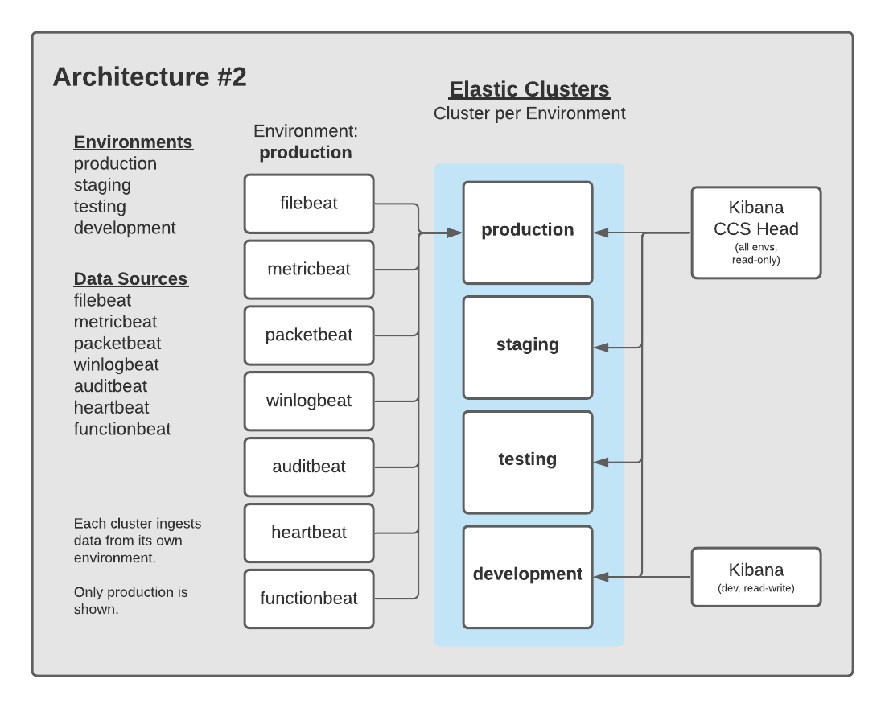
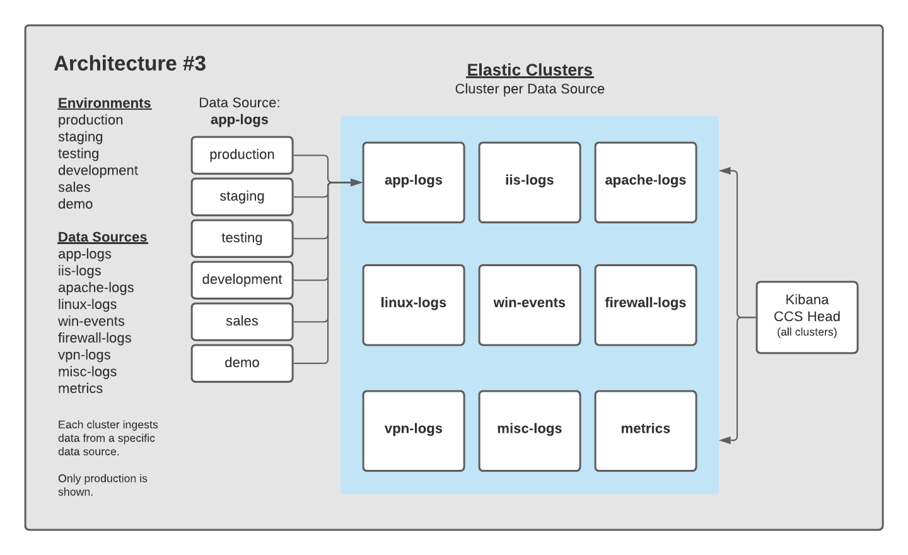
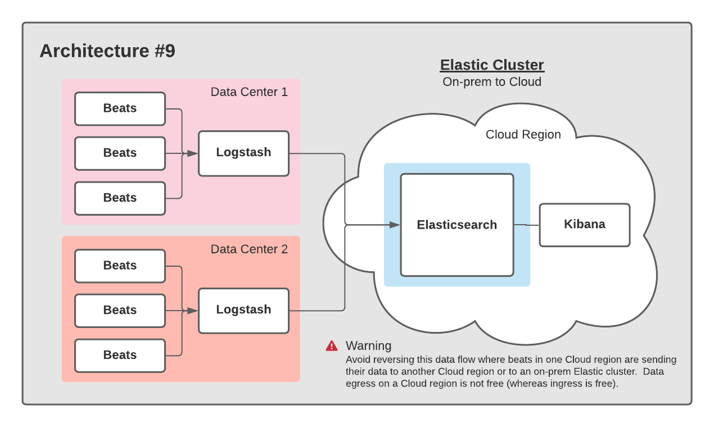
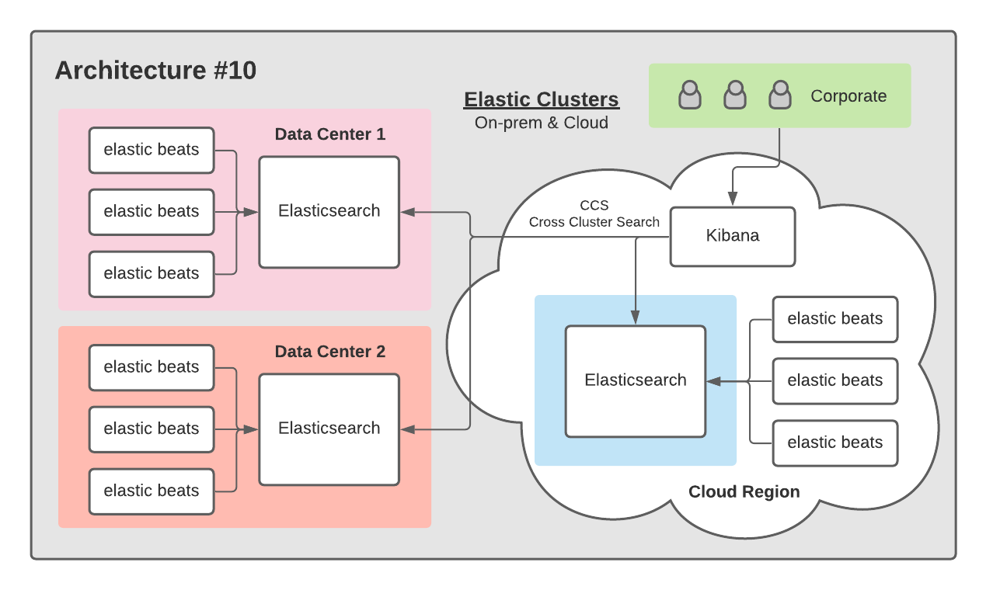
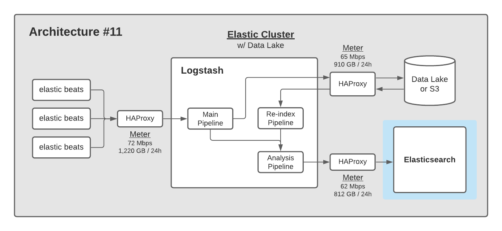

# Elastic Architectures

This directory provides a series of layouts for Elasticsearch clusters.  The goal is to share architectures of various data flows for environments using the Elastic Stack.

Architectures are *not* ranked by popularity, simply by a number so they can easily be referenced.  Some architectures are not particularly great, but represented for thoroughness.

## Architecture #1

A relatively standard pattern of having one Elastic cluster per environment, with each environment having its own Kibana instance.  Each cluster is ingesting data from data sources only from its environment.

## Architecture #2

A pattern involving one Elastic cluster per environment, but consolidating Kibana activity to a single Kibana CCS Head for all environments.  Typically, this Kibana instance can be read-only for the majority of users accessing it.  A read-write Kibana instance can be deployed into a lower environment that gives users read-write permissions to create & edit Dashboards, ML jobs, etc.

Pros:

- Having a Kibana CCS Head allows you to see across all environments to compare behavior

## Architecture #3

A pattern involving one Elastic cluster per data source, with a Kibana CCS Head.

Pros:

- One pane of glass to see all data
- Isolation between data sources

## Architecture #4

A pattern involving a separate production Elastic cluster set to isolate prod from lower environments.  One or two Kibana CCS heads can be used to view cross sections of the data being collected.

Pros:

- Better stability for production

## Architecture #5

This pattern represents one of the most common data flows for data into Elasticsearch.  Elastic Beats are installed on a number of systems, shipping data directly into Elasticsearch.

## Architecture #6

This pattern represents another common data flow for data into Elasticsearch.  Elastic Beats are installed on a number of systems, sending data to Logstash, which in turn ships the data into Elasticsearch.

## Architecture #7

This pattern represents yet another common data flow for data into Elasticsearch.  Elastic Beats are installed on a number of systems, sending data to a Message Queue.  Logstash then pulls from the Message Queue, and ships the data into Elasticsearch.

## Architecture #8

Using a reverse-proxy / load-balancer in your architecture provides two key benefits:

- Bit counters on inputs
- Resiliency around ingest

## Architecture #9

A common pattern for companies with data centers that are moving to Cloud is to stand up new services in their Cloud provider.  This pattern gives them flexibility in managing an Elastic cluster with the ability to dynamically provision VMs or Clusters (using either [cloud.elastic.co](https://cloud.elastic.co) or [ECE](https://www.elastic.co/ece)/[ECK](https://www.elastic.co/elastic-cloud-kubernetes).

## Architecture #10

For companies with Data Centers and a Cloud provider, this pattern leverages Cross Cluster Search (CCS) to avoid egress fees.  Users query the clusters through one Kibana instance.

## Architecture #11

Many companies write raw data to a Data Lake or object store like S3 for long term retention.  To accompany this pattern, Elastic is often used as the System of Analysis.  This architecture highlights the role of Logstash to filter raw ingest and send it both to the Data Lake and to Elastic.  HAProxy is used to meter key flow points.

## Architecture #12

Disaster Recovery comes in many shapes and sizes.  From offsite backups to Active/Active systems with full redundancy, there are many considerations to be made.  This pattern leverages Cross Cluster Replication (CCR) to create an Active/Passive cluster topology.

More patterns involving CCR are available in the [CCR documentation](https://www.elastic.co/guide/en/elasticsearch/reference/current/xpack-ccr.html).

## Architecture #13

Dedicated node types are recommended in clusters with 6 or more nodes.  This practice isolates [node roles](https://www.elastic.co/guide/en/elasticsearch/reference/current/modules-node.html) so they have dedicated resources to carry out their function.

------

### Contribute

You can add an architecture if it is new or a variant of an existing one.  To do so, fork the repo, increment the last architecture number, and submit a pull request.

For example, if the last architecture is labeled #23, submit yours and label #24.  This makes it easy to uniquely identify a specific architecture.  Update the REAME.md to include your architecture with a short description about it.
 
